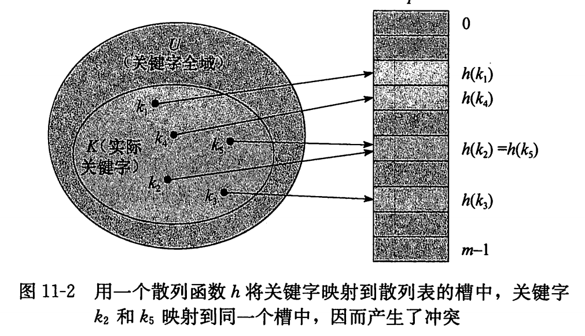
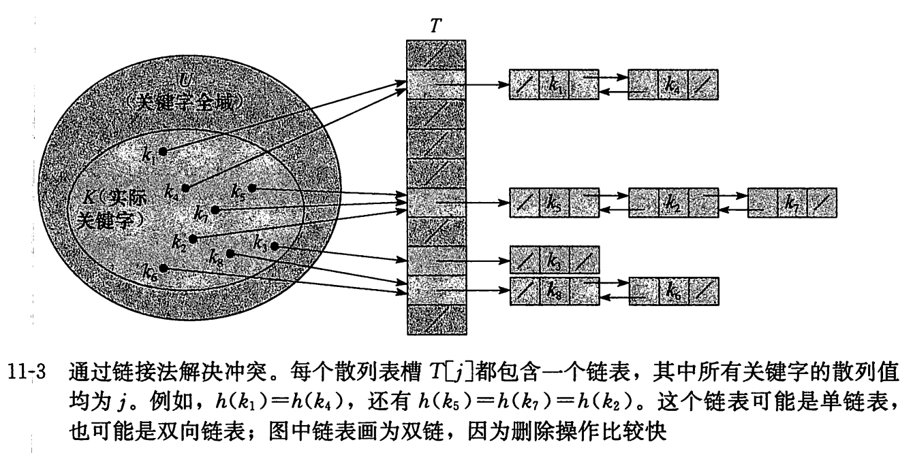

# Chapter1 算法初步
## 1.0 散列
散列(hash)是常用的算法思想之一。
散列表是普通数组概念的推广，由于对普通数组可以直接寻址，使得能在$O(1)$时间内访问数组中的任意位置。
当实际存储的关键字数目比全部的可能关键字总数要小时，采用 **散列表**就成为 **直接数组寻址** 的一种有效替代，因为 散列表使用一个长度与实际存储的关键字数目成比例的数组来存储。在散列表中，不是直接把关键字作为数组的下标，而是根据关键字计算出相应的下标。

出现 **冲突**，此时最简单的冲突解决方法：**链接法**，**开发寻址法**。
**通过链接法解决冲突**
将散列到同一个槽中的所有元素都放在一个链表中，

散列(hash),一般来说，散列就是：**将元素通过一个函数转换为整数，使得该整数可以尽量唯一地代表这个元素。**，其中把这个 转换函数称为 **散列函数H**,在转换前为 key,转换后为 H(key).
**常用的散列函数**：直接定址法，平方取中法，除留余法。
**除留余法** 是指把 key除一个数 mod得到的 余数作为 hash值的方法：
$$ H(key)  = key\%mod $$
**解决冲突**：
1. 线性探查法(Linear Probing)
当得到key的hash值H(key)，但是表中下标为 H(key)的位置已经被某个其他元素使用了，那么就检查下一个位置 H(key)+1是否被占。

2. 平方探查法(Quadratic probing)
在平方探查法中，为了尽可能避免扎堆现象，表中下标为 H(key)的位置被占时，按照以下顺序检查表中的位置：$H(key) + 1^2$,$H(key) - 1^2$,$H(key) + 2^2$,$H(key) - 2^2$,$H(key) + 3^2$.......
如果超过了表长 TSize,那么就把 $H(key) + k^2$对表长 TSize取模。

3. 链地址法(拉链法)

## 1.1 字符串hash初步
**字符串hash**是指将一个字符串S映射为一个整数，使得该整数可以尽可能唯一地代表字符串S.
**假设字符串均由A~Z构成**，将A~Z视为0~25，这样就把26个大写字母对应到了26进制中，接着，将26进制转换为10进制，肯定时唯一的。