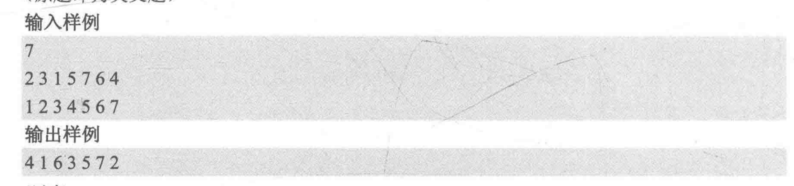
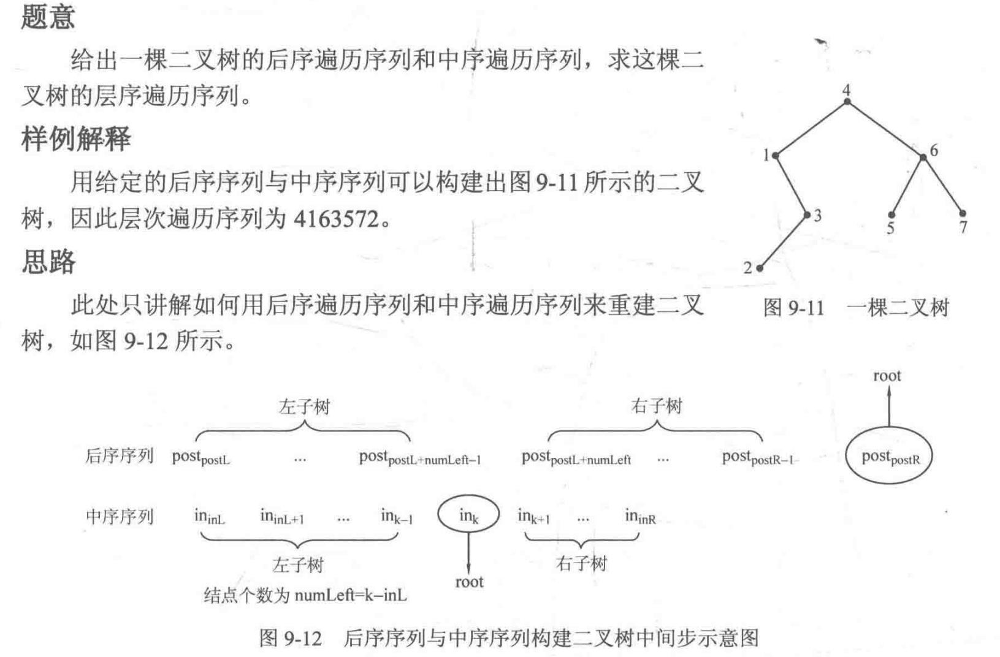
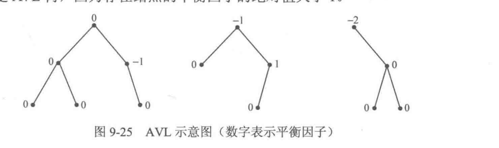
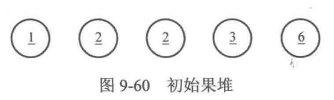
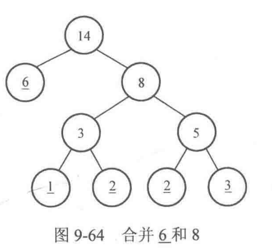

# Chapter4 数据结构
## 1.0 树和二叉树
树(tree)，
1. 树可以没有节点，这种情况下树称为 空树(empty tree)
2. 树的层次(layer)从根节点开始算起，即根节点为第一层，树根节点子树的根节点为第二层
3. 把节点的子数棵树称为节点的度(degree),而树中节点的最大的度称为树的度(也叫做树的宽度)
4. 由于一条边连接两个节点，且树种不存在环，因此对有n个节点的树，边数一定是n-1.且 满足连通、边数等于顶点数减1的结构一定是一棵树
5. 叶子节点被定义为度为0的节点，因此当树中只有一个节点(即根节点)时，根节点也算 **叶子节点**
6. 许多树组合在一起称为森林

## 1.1 二叉树的递归定义
1. **满二叉树**，每一层节点个数都达到了当层能达到的最大节点数。
2. **完全二叉树**，除了最下面一层之外，其余层的节点个数都达到了当层能达到的最大的节点数，且最下面一层的节点都集中在最左边。

## 1.2 二叉树的存储结构
二叉树使用链表来表示，和普通链表的区别时，由于二叉树的每个节点右两条边。
```C++
struct node{
    ttpename data;
    node* lchild;
    node* rchild;
}
```

## 1.3 二叉树节点的查找和修改
如果函数中需要新建节点，即对二叉树的结构做出修改，就需要加引用；如果只是修改当前已有节点的内容，或仅仅是遍历树，不需要加引用。
root == NULL 与 *root ==NULL 的区别。也即 地址为NULL与节点类容为NULL的区别(也相当于 **节点不存在** 与 **节点存在但没有内容的区别**)。由于在二叉链表中一般都是判定 **节点是否存在**， 一般使用 **root ==NULL**

## 1.4 遍历
* 先序遍历 
根左右：
* 中序遍历
左根右
* 后序遍历
左右根

## 1.5 给定一棵二叉树的后序遍历和中序遍历序列，求二叉树的层序遍历序列


递归过程中某步的后序序列区间为[postL,postR],中序遍历区间为[inL,inR],后序遍历的最后一个元素post[postR]即为根节点。需要在中序遍历找 **一个位置k**，使得 in[k] == post[postR]，找到了中序中的根节点，左子树节点个数为 numLeft - k-inL，左子树后序序列区间为 [postL,postL+numberLeft-1],左子树的中序序列区间为[inL,k-1]
```C++
// 后序遍历和中序遍历求得--层序遍历.cpp : 此文件包含 "main" 函数。程序执行将在此处开始并结束。
//

#include "pch.h"
#include <iostream>
#include <string>
#include <queue>
#include <algorithm>
#include <vector>
using namespace std;

struct node
{
	int data;
	node* lchild;
	node* rchild;
};

vector<int> pre;//先序
vector<int> in;//中序
vector<int> post;//后序
int n;//节点个数

//当前二叉树的后序序列区间为[postL,postR],中序序列区间为[inL,inR]
//create函数返回构建出的二叉树的根节点地址
node* create(int postL, int postR, int inL, int inR)
{
	if (postL > postR)
	{
		return NULL;//后续序列长度小于等于0时，直接返回
	}
	node* root = new node;//新建一个节点，用来存放当前二叉树的根节点
	root->data = post[postR];//新节点的数据域为根节点的值
	int k;
	for (k = inL; k <= inR; k++)
	{
		if (in[k] == post[postR])
		{
			break;//在中序序列中找到 in[k] == pre[L] 的节点
		}
	}
	int numLeft = k - inL;//左子树的节点个数
	//返回左子树的根节点地址，赋值给root的左指针
	root->lchild = create(postL, postL + numLeft - 1, inL, k - 1);
	root->rchild = create(postL + numLeft, postR - 1, k + 1, inR);
	return root;

}
int num = 0;//已经输出的节点个数
void BFS(node* root)//层序遍历
{
	queue<node*> q;//注意这里的队列存放的地址
	q.push(root);
	while (!q.empty())
	{
		node* now = q.front();
		q.pop();
		cout << now->data;
		num++;
		if (num < n); cout << " ";
		if (now->lchild != NULL) q.push(now->lchild);
		if (now->rchild != NULL) q.push(now->rchild);
	}
}

int main()
{
	cin >> n;
	pre.resize(n);
	in.resize(n);
	post.resize(n);
	for (int i = 0; i < n; i++)
		cin >> post[i];
	for (int i = 0; i < n; i++)
		cin >> in[i];
	node *root = create(0, n - 1, 0, n - 1);
	BFS(root);
	return 0;
}
```

## 1.6 二叉查找树
二叉查找树(Binary Search Tree,BST)是一种特殊的二叉树
1. 二叉查找树为空树
2. 左子树所有节点的数据域均小于或等于根节点的数据域，右子树上所有节点的数据域均大于根节点的数据域。

## 1.7 平衡二叉树
AVL树，左子树和右子树的高度之差称为该节点的 **平衡因子**，

只要能随时保证每个节点平衡因子的绝对不超过1，AVL的高度就始终能保持O(logn)级别，

## 1.8 并查集
并查集是一种维护集合的数据结构，它的名字中“并”“查”“集'".意味着Union Find Set

## 1.9 哈夫曼树
树的带权路径长度(Weighted Path Length of Tree)等于它所有叶子节点的带权路径长度之和。
带权路径长度最小的树被称为 **哈夫曼树**。
1. 初始状态下共有n个节点(节点的权值分别是给定的n个数)，将它们视作n棵只有一个节点的树。
2. 合并其中根节点权值最小的两棵树，生成两棵树根结点的父节点，权值为这两个根节点的权值之和，这样树的数量就减小了一个。
3. 重复操作2，直到只剩下一棵树为止，这棵树就是哈夫曼树。


**哈夫曼树的构建思想**： 反复选择两个最小的元素，合并，直到只剩下一个元素。
```C++
// 哈夫曼树--合并果子.cpp : 此文件包含 "main" 函数。程序执行将在此处开始并结束。
//

#include "pch.h"
#include <iostream>
#include <queue>	
#include <vector>
using namespace std;

priority_queue<long long, vector<long long>, greater<long long>> q; //数字小的优先级越大
int main()
{
	int n;
	long long temp, x, y, ans = 0;
	cin >> n;
	for (int i = 0; i < n; i++)
	{
		cin >> temp;
		q.push(temp);//将初始重量压入优先队列中
	}
	while (q.size() > 1)//只要优先队列中至少有两个元素
	{
		x = q.top();
		q.pop();
		y = q.top();
		q.pop();
		q.push(x + y);//取出堆顶的两个元素，求和后压入优先队列
		ans += x + y;//累计求和的结果
		cout << "LLD: " << ans << endl;
	}
}
```

## 2.0 哈夫曼编码
寻找一套编码方式，使得其中 **任何一个字符的编码都不是另一个字符的编码的前缀，同时把满足这种编码方式的编码称为前缀编码**。
将每个字符的出现次数作为叶子节点的权值，求一棵树，使得这棵树的带权路径长度最小。--哈夫曼树